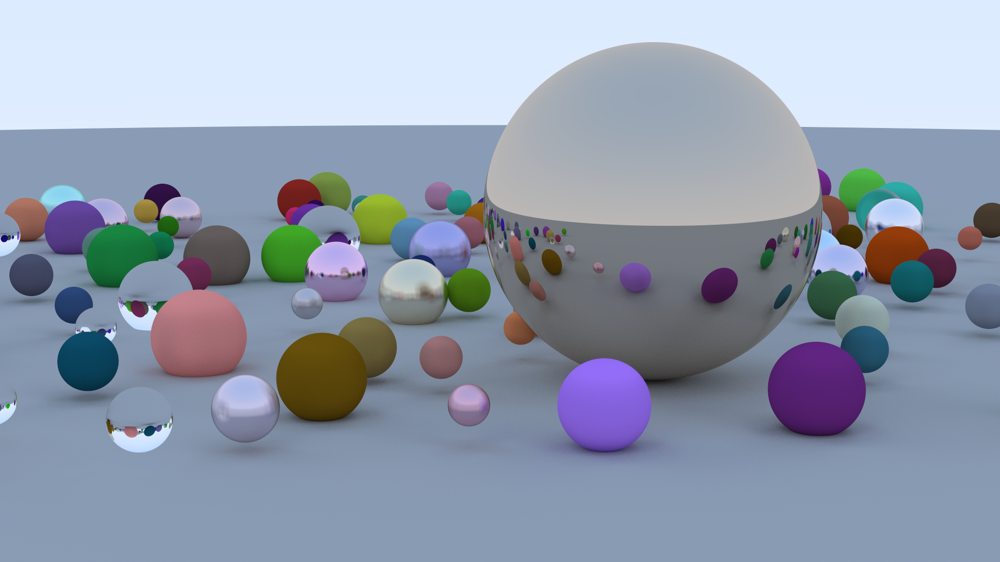

# A5-RayTracing

|  |
|:--:|
| 1920x1080, 500 samples per pixel, 19h rendering time on Ryzen 9 5900x |
## The idea

This project will approach ray-tracing using different programming languages, you can find details about each of them in the respective wiki page associated below

- [Python](./python_rayt/readme.md)
- [Python (Numpy)](./python_numpy_rayt/readme.md)

## Wiki Section

- [What is ray tracing?](./docs/what_is_ray_tracing.md)
- [Comparisons](./docs/comparisons.md)
- [Going further](./docs/going_further.md)
- [Medium Post](https://medium.com/@giuseppe.dimarco.23/ray-tracing-from-0-to-1-out-of-100-a901b9590718)

## Team members 🇮🇹

- Giuseppe Di Marco
- Alessandro Mancini

## Python's instructions

1. Clone the repository on your machine
2. `cd <project folder>`
3. Install the requirements with the command `pip install -r requirements.txt`
4. You can either: 
    1. Run the `python_gui.py` file with the `python python_gui.py` (or click the run button on Visual Studio Code)
    2. Run the `python_cli.py` file with the `python python_cli.py`. If you need help, use the `-h` flag
5. Wait some time (look at the [Comparisons](./docs/comparisons.md) to have an overall idea of how much time will the program need to execute)

## Recommendations

The image will have the `.pmm` extension, you can either install the "PBM/PPM/PGM Viewer for Visual Studio Code" from the extensions marketplace of Visual Studio, or use this [online tool](https://www.cs.rhodes.edu/welshc/COMP141_F16/ppmReader.html) to visualize the image.

Be patient!

## C#'s instruction

1. Download at the [latest release](https://github.com/CIS1221-2023-2024/A5-RayTracing/releases/tag/v1) the zip for you operating system
2. Unzip the folder and click on the executable file
    1. If you are on Windows, execute the `TestRayt` file
    2. If you are on Linux, execute the `rayTracing_linux` file
