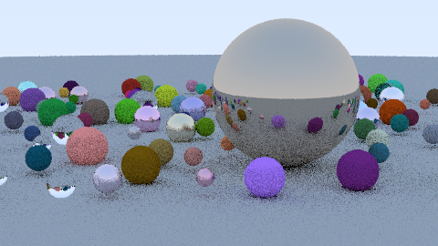
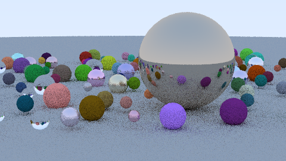
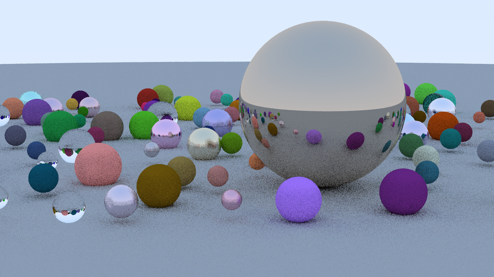
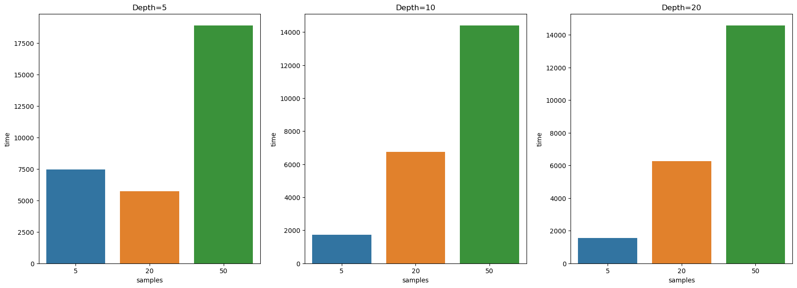
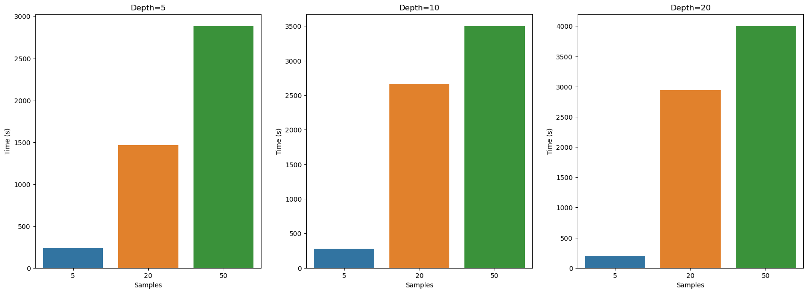
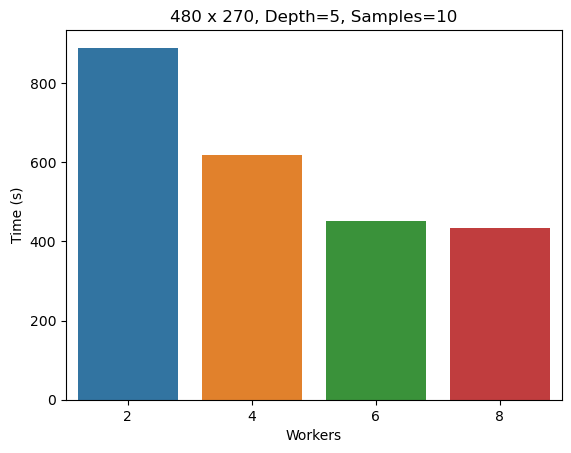
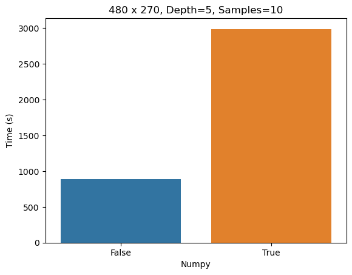

# Comparisons

## Table of contents

### [1. Introduction](#introduction)

### [2. Comparison Criteria](#comparison-criteria)

### [3. Comparison Results](#comparison-results)

### [4. Numpy Drama](#numpy-drama)

### Introduction

Benchmarking a raytracer is not a trivial task, indeed, it can take very long to generate a single images when using CPU, as it is in our case. To mitigate this, we decided to parallelize the rendering process using the multiprocessing module of Python. This allowed us to generate the images in a reasonable amount of time, obtaining big performance boosts.

### Comparison Criteria

We decided to compare our raytracer results based on 3 parameters:

- Samples per pixel
- Shadow recursion depth
- Resolution
In the next section we will see how varyinig these parameters affects the final image.

### Comparison Results

We generated a total of 12 images, each one with different parameters. Let's see the results side by side:
Fixing a depth of 5, we can see how the image quality improves as we increase the number of samples per pixel:

| |  | |
|:--:|:--:|:--:|
| 5 samples | 20 samples | 50 samples |

However, increasing the number of samples per pixel is not the only way to improve the image quality. We can also increase the shadow recursion depth, which will result in a more accurate shadow computation. Let's see how the image quality improves as we increase the shadow recursion depth:

| |  | |
|:--:|:--:|:--:|
| 5 depth | 10 depth | 20 depth |
Notice how the shadows are better displayed

Finally, we can also increase the resolution of the image, which will result in a more detailed image. Let's see how the image quality improves as we increase the resolution:

| |
|:--:|
| 480x270 |

| |
|:--:|
| 1280x720 |

However, this comes at a cost. Let's see how much higher is the rendering time for 1280x720 resolution:

| |
|:--:|
| 1280x720 rendering time |

This is the highest resolution we were able to render with our PC, and this is the result:

| |
|:--:|
| 1280x720 resolution |

Increasing the quality also increases the rendering time. Let's see how the rendering time varies as we increase the number of samples per pixel:

| |
|:--:|
| Samples per pixel vs Rendering time |

It is important to note that the images above were generated using the multiprocessing module of Python, which allowed us to parallelize the rendering process. This resulted in a big performance boost, as we can see in the following table:

| |
|:--:|
| Rendering time for Number of Workers |

### Numpy Drama

We decided to use the numpy module to speed up the computation of the raytracer. However, we found out that the overhead of using numpy to create arrays was too big and it acctually slowed down the computation. Let's see how the rendering time varies as we enable the numpy module:

| |
|:--:|
| Numpy Off Vs Numpy On |
